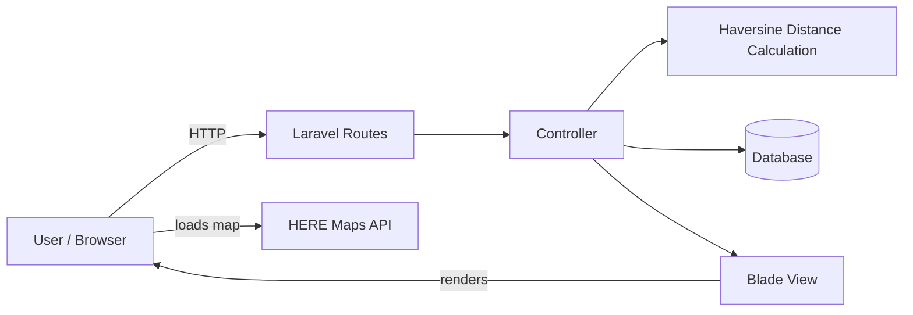

# Web Geolocation with Laravel

A Laravel web application that implements the **Haversine algorithm** to calculate the distance between geographic coordinates, using **HERE Maps** to display locations on a map. Built as a thesis (skripsi) project.

## Tech Stack

| Area | Technology |
|------|------------|
| Backend | PHP, Laravel |
| Frontend | Blade templates, JavaScript (npm) |
| Map | HERE Maps |
| Algorithm | Haversine formula |
| Dependency management | Composer, npm |
| Testing | PHPUnit |

## Architecture



1. The user opens a page rendered by a Blade view.
2. The page loads the HERE Maps API to display the map and the user's or target locations.
3. Laravel receives coordinates through its routes and controllers.
4. The controller uses the Haversine formula to compute the distance between points.
5. The result is returned to the view and shown on the map.

## Haversine Algorithm

The Haversine formula gives the great-circle distance between two points on a sphere from their latitude and longitude:

```
a = sin²(Δφ / 2) + cos φ1 · cos φ2 · sin²(Δλ / 2)
d = 2 · R · atan2(√a, √(1 − a))
```

| Symbol | Meaning |
|--------|---------|
| φ1, φ2 | Latitude of point 1 and point 2 (in radians) |
| Δφ, Δλ | Difference in latitude and longitude (in radians) |
| R | Earth's mean radius (about 6371 km) |
| d | Distance between the two points |

## Project Structure

```
├── app          # Application code (models, controllers)
├── bootstrap    # Framework bootstrap
├── config       # Configuration files
├── database     # Migrations, seeders, factories
├── public       # Web root and public assets
├── resources    # Blade views, JS, CSS
├── routes       # Route definitions
├── storage      # Logs, cache, uploaded files
├── tests        # PHPUnit tests
├── artisan      # Laravel CLI
├── composer.json
└── package.json
```

## Getting Started

Requirements: PHP, Composer, Node.js with npm, a database supported by Laravel, and a HERE Maps API key.

```bash
# Install dependencies
composer install
npm install

# Configure environment
cp .env.example .env
php artisan key:generate
```

Then edit `.env`:

- Set your database connection.
- Add your HERE Maps API key.

```bash
# Create database tables
php artisan migrate

# Build assets and start the server
npm run dev
php artisan serve
```

The app will be available at `http://localhost:8000`.

To run the tests:

```bash
php artisan test
```
